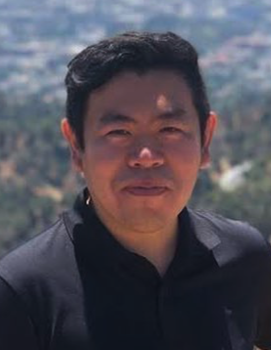

<h2>Principal Investigator</h2>

  
  

    <strong>Ken Zhao</strong> 
    Assistant Professor, University of North Carolina at Chapel Hill
  

  

    Ken leads the Carolina Dynamical Oceanography Group. His research focuses on the physical dynamics of polar oceans, coastal circulation, and geophysical fluid dynamics. Ken is currently vice-chair of the international 
    <a href="https://sites.google.com/view/jcioi/home" target="_blank">Joint Commission on Ice Ocean Interactions</a> (IUGG IAPSO).
  

<h2>Current Group Members</h2>

<h3>Postdoctoral Researchers</h3>

  
  
<strong>Madie Mamer</strong> 
  Postdoctoral Research Scholar, UNC Chapel Hill

  
<strong>Project:</strong> <em>Ice-ocean interactions using modeling and laboratory experiments</em>

<h3>Graduate Students</h3>

  
  
<strong>Yiwen Hu</strong> 
  Graduate Student, UNC Chapel Hill

  
<strong>Project:</strong> <em>Ice-ocean interactions using modeling and laboratory experiments</em>

<h3>Postbaccalaureate Researchers</h3>

  <h4>Tyler Britt</h4>
  
<strong>Postbac Researcher, UNC Chapel Hill (Aug 2025 – present)</strong>

  
<strong>Project:</strong> <em>Seawater-Ice Laboratory Experiments</em>

<h3>Undergraduate Researchers</h3>

  <h4>Victor Nguyen</h4>
  
<strong>UNC Chapel Hill (June 2025 – present)</strong>

  
<strong>Project:</strong> <em>Dynamics of Carolina's shoals</em>

  <h4>Krit Negi</h4>
  
<strong>UNC Chapel Hill (Aug 2025 – present)</strong>

  
<strong>Project:</strong> <em>Lagrangian floats in polar and coastal systems</em>

  <h4>Mason Redd</h4>
  
<strong>UNC Chapel Hill (Jan 2026 – present)</strong>

  
<strong>Project:</strong> <em>Upwelling in the Galapagos</em>

  <h4>Sarah Villhauer</h4>
  
<strong>UCLA &amp; REU student at Oregon State University (June 2022 – present)</strong>

  
<strong>Project:</strong> <em>Dynamics of Antarctica’s melting basal channels</em>

<h2>Former Group Members</h2>

  
<strong>Kaylie Cohanim</strong>, Undergraduate Researcher, UCLA (Apr 2018 – Jul 2020) 
  Project: <em>Dynamics of sea ice lead-generated eddies</em>; Publication: <a href="https://journals.ametsoc.org/view/journals/phoc/51/10/JPO-D-20-0169.1.xml">Cohanim et al. 2021</a> 
  Next Position: PhD Student, Princeton University
  

  
<strong>Jennifer Kosty</strong>, Undergraduate Researcher, UCLA (Aug 2020 – Aug 2023) 
  Project: <em>Seal-based observations of Antarctic sub-sea ice eddies</em>; Publication: <a href="https://agupubs.onlinelibrary.wiley.com/doi/pdfdirect/10.1029/2024JC021781">Kosty et al. 2025</a> 
  Next Position: PhD Student, Yale University
  

